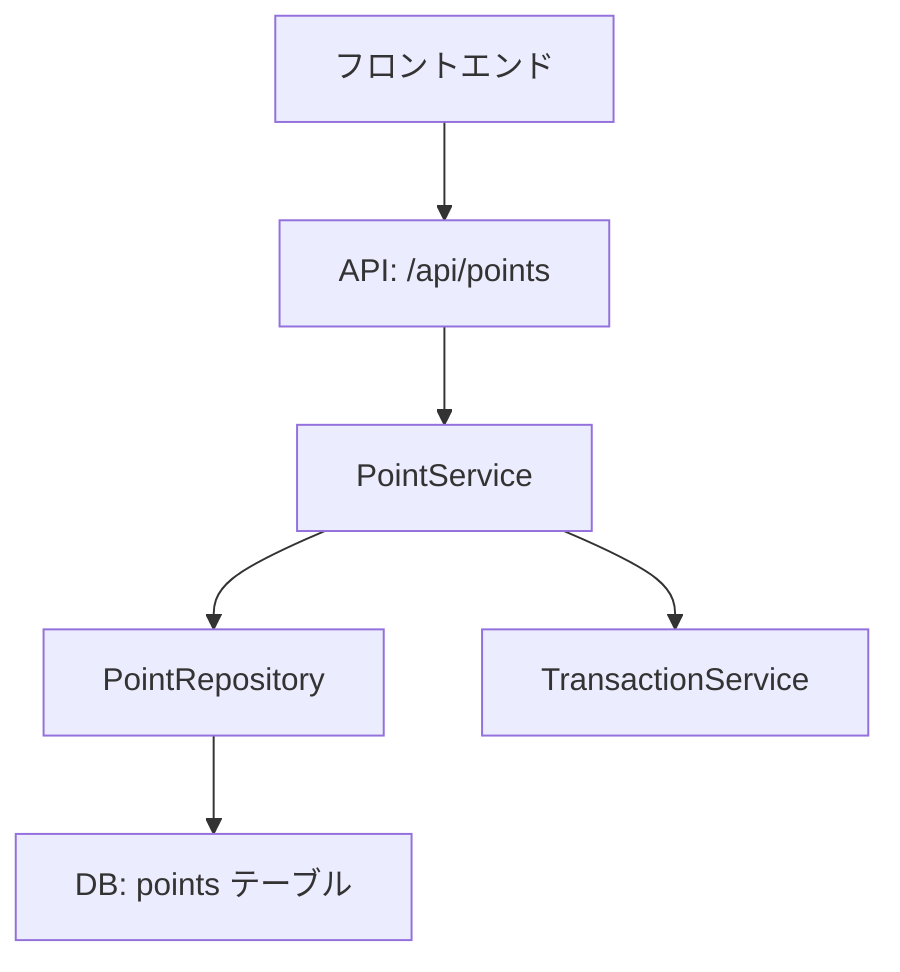

# CMD_dv_10_DesignDoc作成

最終更新日時: 2026年1月29日

# DesignDoc自動生成テンプレート

> **既存コードと要件から設計書を自動生成（HITL対応）**

---

## 🎯 このテンプレートでできること

- 既存コードベースの構造解析
- 要件に基づいた設計書（DesignDoc）の自動生成
- アーキテクチャ図・シーケンス図の作成
- API仕様・データモデルの設計
- ADR（Architecture Decision Records）の作成
- **Human-in-the-Loop（HITL）で人間レビューを挟む**

---

## 📋 実行前の質問（必須回答）

### 1. コードベース情報
- GitHubリポジトリURL: 
- 対象ディレクトリ/ファイル: 
- 主要言語: （TypeScript, Python, Java等）
- 使用フレームワーク: 

### 2. 設計対象
- 機能名: 
- 機能概要: 
- 対象ユーザー: 

### 3. 要件情報
- 機能要件（箇条書き）: 
- 非機能要件（性能、セキュリティ等）: 
- 制約条件: 

---

## 🔄 実行手順

### Phase 1: コンテキスト収集（15分）【自動】

```yaml
実行内容:
  - 既存コード構造を解析
  - 技術スタックを特定
  - 依存関係を可視化
  - 既存パターンの抽出

使用Role: role_code_analyst

成果物:
  - context_analysis.md
  - dependency_graph.mermaid
  - tech_stack_summary.md
```

**AIの動作:**
```
🔍 コードベースを解析しています...

【コード構造】
/src
  /components    ← Reactコンポーネント
  /services      ← ビジネスロジック
  /repositories  ← データアクセス
  /api           ← APIルート

【技術スタック】
- Frontend: Next.js 14 (App Router)
- Backend: Next.js API Routes
- Database: PostgreSQL (Prisma ORM)
- Auth: NextAuth.js
- Styling: Tailwind CSS

【依存関係】
component → service → repository → DB
component → api → service → repository → DB

【既存パターン】
- レイヤードアーキテクチャ
- Repository パターン
- RESTful API設計

解析完了しました！
📄 context_analysis.md を生成しました
```

---

### HITL-1: コンテキスト確認（5分）【人間】

**プロンプト:**
```
📋 コード解析結果を確認してください

以下の情報は正確ですか？追加情報があれば入力してください。

【確認事項】
✓ 技術スタック
✓ 既存アーキテクチャパターン
✓ 既存APIの命名規則
✓ データモデルの設計方針

【質問】
1. 既存の設計ドキュメントはありますか？（あればURLを共有）
2. チーム固有のコーディング規約はありますか？
3. 特に考慮すべき制約や懸念事項はありますか？

次のステップに進むには「続行」と入力してください。
修正がある場合は、具体的に指示してください。
```

---

### Phase 2: 設計書ドラフト生成（30分）【自動】

```yaml
実行内容:
  - 要件を構造化（機能/非機能）
  - アーキテクチャ図を生成
  - コンポーネント設計
  - API仕様を定義
  - データモデルを設計
  - シーケンス図を作成

使用Role: role_software_architect

成果物:
  - design_doc_draft.md
  - architecture_diagram.mermaid
  - sequence_diagrams.mermaid
  - api_spec_draft.yaml
  - data_model_draft.md
```

**AIの動作:**
```
📝 設計書ドラフトを生成しています...

━━━━━━━━━━━━━━━━━━━━━━━━━━━━━━━━━━━━
# ポイント機能 設計書（ドラフト）

## 1. 概要
### 1.1 背景・目的
ユーザーエンゲージメント向上のため、購入金額に応じて
ポイントを付与し、次回購入時に利用できる機能を実装する。

### 1.2 スコープ
対象範囲:
- ポイント付与（購入時）
- ポイント利用（決済時）
- ポイント履歴表示

対象外:
- ポイントの有効期限管理（Phase 2）
- ポイントのギフト機能（Phase 2）

## 2. 要件サマリ
### 2.1 機能要件
- FR-001: 購入金額の1%をポイント付与
- FR-002: ポイントを決済時に利用可能
- FR-003: ポイント残高・履歴を表示

### 2.2 非機能要件
- 性能: レスポンスタイム200ms以内
- セキュリティ: ポイント改ざん防止
- 可用性: 99.9%以上

## 3. アーキテクチャ


## 4. データ設計
### 4.1 データモデル

```sql
CREATE TABLE points (
  id UUID PRIMARY KEY,
  user_id UUID REFERENCES users(id) NOT NULL,
  amount INTEGER NOT NULL,
  type VARCHAR(20) NOT NULL, -- 'EARN' | 'SPEND' | 'EXPIRED'
  description TEXT,
  created_at TIMESTAMP DEFAULT NOW()
);

CREATE TABLE point_balances (
  user_id UUID PRIMARY KEY REFERENCES users(id),
  balance INTEGER NOT NULL DEFAULT 0,
  updated_at TIMESTAMP DEFAULT NOW()
);
```

### 4.2 API設計

| メソッド | パス | 説明 |
|---------|------|------|
| GET | /api/points | ポイント履歴取得 |
| GET | /api/points/balance | 残高取得 |
| POST | /api/points/earn | ポイント付与 |
| POST | /api/points/spend | ポイント利用 |

## 5. 実装計画
Phase 1（2週間）:
- ポイント付与・利用の基本機能
- ポイント残高表示

Phase 2（1週間）:
- 履歴表示（ページネーション）
- フィルタリング機能

━━━━━━━━━━━━━━━━━━━━━━━━━━━━━━━━━━━━

📄 design_doc_draft.md を生成しました
📊 アーキテクチャ図を生成しました
```

---

### HITL-2: 設計レビュー（10分）【人間】

**プロンプト:**
```
📋 設計書ドラフトをレビューしてください

以下の観点で確認をお願いします：

【確認観点】
✓ 要件が正しく反映されているか
✓ アーキテクチャ設計は適切か
✓ データモデルは過不足ないか
✓ API設計は既存の規約に沿っているか
✓ 非機能要件が考慮されているか

【修正指示の例】
- 「ポイント有効期限カラムを追加してください」
- 「API認証方式をJWTからSession方式に変更してください」
- 「ポイント付与率を1%から5%に変更してください」

次のステップに進むには「承認」と入力してください。
修正が必要な場合は、具体的に指示してください。
```

---

### Phase 3: 最終化（10分）【自動】

```yaml
実行内容:
  - フィードバックを反映
  - ADR（設計判断記録）作成
  - シーケンス図の追加
  - エラーハンドリング設計
  - セキュリティ設計の追加

使用Role: role_software_architect

成果物:
  - design_doc_final.md
  - adr/001-point-system-design.md
  - api_spec.yaml（OpenAPI形式）
```

**AIの動作:**
```
✅ フィードバックを反映しています...

【反映内容】
- ポイント有効期限カラム追加
- 有効期限チェックロジックを設計に追加
- ADRに「ポイント有効期限管理」の決定を記録

📄 design_doc_final.md を生成しました
📄 adr/001-point-system-design.md を生成しました
📄 api_spec.yaml を生成しました

━━━━━━━━━━━━━━━━━━━━━━━━━━━━━━━━━━━━
✨ DesignDoc作成が完了しました！

【生成ファイル】
1. design_doc_final.md          ← メイン設計書
2. architecture_diagram.mermaid  ← アーキテクチャ図
3. sequence_diagrams.mermaid     ← シーケンス図
4. api_spec.yaml                 ← API仕様書
5. adr/001-point-system-design.md ← 設計判断記録

【次のステップ】
- テスト計画作成: CMD_dv_11_テスト計画作成
- 実装開始: CMD_sys_05_バックエンド実装
━━━━━━━━━━━━━━━━━━━━━━━━━━━━━━━━━━━━
```

---

## ✅ 完了条件チェックリスト

- [ ] コードベース解析が完了している
- [ ] 要件が構造化されている
- [ ] アーキテクチャ図が作成されている
- [ ] データモデルが定義されている
- [ ] API仕様が詳細に記載されている
- [ ] ADRで技術判断が記録されている
- [ ] 実装計画が具体的である
- [ ] レビューが完了し承認されている

---

## 🎨 生成されるDesignDocの構成

```markdown
# [機能名] 設計書

## 1. 概要
- 背景・目的
- スコープ
- 用語定義

## 2. 要件サマリ
- 機能要件
- 非機能要件

## 3. アーキテクチャ
- 全体構成
- コンポーネント図
- シーケンス図

## 4. データ設計
- データモデル（ER図）
- スキーマ定義
- API設計

## 5. 実装計画
- フェーズ分割
- リスクと対策
- 依存関係

## 6. テスト方針
- テストレベル
- テスト観点

## 7. 運用設計
- 監視項目
- ログ設計

## 8. ADR
- 技術選定の記録
- トレードオフの明示
```

---

## 💡 ADRテンプレート例

```markdown
# ADR-001: ポイントシステムのデータ構造設計

**日付**: 2026-01-29
**ステータス**: Accepted

## コンテキスト
ポイントシステムのデータ構造として、以下の2案を検討した：
1. 残高管理テーブル + 履歴テーブル
2. 履歴テーブルのみ（残高は集計で算出）

## 決定
案1（残高管理テーブル + 履歴テーブル）を採用する

## 理由
- 残高照会の頻度が高く、都度集計はパフォーマンス問題
- トランザクション制御で整合性を担保可能
- 履歴は監査目的で必須

## トレードオフ
**メリット**:
- 高速な残高照会
- 整合性の担保

**デメリット**:
- テーブルが増える
- 更新処理が複雑化

## 代替案
- 案2: 履歴のみで管理
  - メリット: シンプル
  - デメリット: 残高照会が遅い
```

---

## 🔗 関連テンプレート

- [CMD_dv_11_テスト計画作成](./CMD_dv_11_テスト計画作成.md)
- [CMD_sys_01_アーキテクチャ設計](../system_building_templates/CMD_sys_01_アーキテクチャ設計.md)
- [CMD_sys_03_API設計](../system_building_templates/CMD_sys_03_API設計.md)

---

## 🎯 活用シーン

### シーン1: 新機能追加
既存システムに新機能を追加する際の設計書作成

### シーン2: リファクタリング
既存機能の再設計・再実装時の設計書作成

### シーン3: システム移行
レガシーシステムから新システムへの移行設計

---

## 📊 所要時間の目安

| フェーズ | 自動 | HITL | 合計 |
|---------|------|------|------|
| Phase 1 | 15分 | - | 15分 |
| HITL-1 | - | 5分 | 5分 |
| Phase 2 | 30分 | - | 30分 |
| HITL-2 | - | 10分 | 10分 |
| Phase 3 | 10分 | - | 10分 |
| **合計** | **55分** | **15分** | **70分** |

---

**作成日**: 2026-01-29
**カテゴリ**: 開発AX（Developer Experience）
**タスクタイプ**: documentation
**関連Role**: role_code_analyst, role_software_architect
