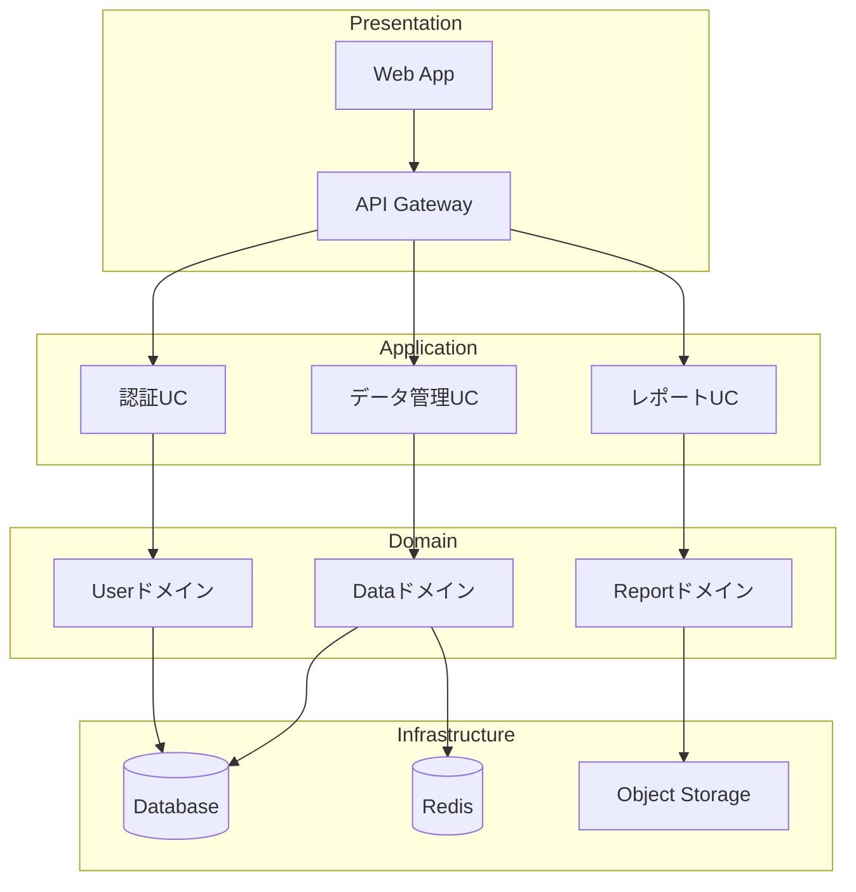

# CMD_sys_01_アーキテクチャ設計

最終更新日時: 2026年1月20日

# システムアーキテクチャ設計テンプレート

> **システム全体の構成・技術選定・設計方針を決定する**

---

## 🎯 このテンプレートでできること

- システム全体のアーキテクチャ設計
- 技術スタック選定
- コンポーネント分割・責務定義
- 非機能要件の設計（スケーラビリティ、セキュリティ等）

---

## 📋 実行前の質問（必須回答）

### 1. システム概要
- システム名は？
- 何を解決するシステムか？
- 主要なユーザーは誰か？

### 2. 機能要件
- 必須機能のリスト
- 優先度（Must/Should/Could/Won't）

### 3. 非機能要件
- 想定ユーザー数・同時接続数
- レスポンス要件（○秒以内）
- 可用性要件（99.9%等）
- セキュリティ要件

### 4. 制約条件
- 技術的制約（既存システムとの連携等）
- 予算・リソース制約
- スケジュール制約

---

## 🔄 実行手順

### Phase 1: 要件整理・分析（15分）

```yaml
実行内容:
  - 機能要件の整理・優先度付け
  - 非機能要件の数値化
  - 制約条件の明確化
  - ステークホルダー分析

成果物:
  - requirements.md（要件定義書）
```

**AIの動作:**
```
📋 要件を整理します

【機能要件】
Must:
  - ユーザー認証・認可
  - データCRUD操作
  - レポート生成

Should:
  - リアルタイム通知
  - 検索・フィルタ

【非機能要件】
  - 同時接続: 1,000ユーザー
  - レスポンス: 200ms以内
  - 可用性: 99.9%
  - セキュリティ: OWASP Top 10対策

この要件で設計を進めますか？
```

---

### Phase 2: アーキテクチャパターン選定（20分）

```yaml
検討項目:
  アーキテクチャスタイル:
    - Monolith（シンプル・小規模向け）
    - Microservices（大規模・スケーラブル）
    - Serverless（イベント駆動・コスト最適化）
    - Modular Monolith（中規模・段階的分離）

  通信パターン:
    - REST API
    - GraphQL
    - gRPC
    - WebSocket

  データ管理:
    - Single Database
    - Database per Service
    - Event Sourcing
    - CQRS

成果物:
  - architecture-decision.md（アーキテクチャ決定記録）
```

**AIの動作:**
```
🏗️ アーキテクチャパターンを選定します

【推奨アーキテクチャ】
スタイル: Modular Monolith
理由:
  - 中規模システムに適切
  - 将来的なマイクロサービス化が容易
  - 初期開発コストが低い

【通信パターン】
メイン: REST API
補助: WebSocket（リアルタイム通知）

【データ管理】
Single Database + 論理的分離
理由: 運用の複雑さを抑えつつモジュール独立性を確保

この方針で詳細設計に進みますか？
```

---

### Phase 3: 技術スタック選定（20分）

```yaml
選定領域:
  フロントエンド:
    - フレームワーク（React/Vue/Next.js/Nuxt等）
    - 状態管理（Redux/Zustand/Pinia等）
    - UIライブラリ（shadcn/ui/Chakra/MUI等）

  バックエンド:
    - 言語・フレームワーク（Node.js/Python/Go/Rust等）
    - ORMツール（Prisma/TypeORM/SQLAlchemy等）
    - 認証（NextAuth/Auth0/Clerk等）

  データベース:
    - RDB（PostgreSQL/MySQL/SQLite）
    - NoSQL（MongoDB/Redis/DynamoDB）
    - 検索（Elasticsearch/Algolia/Meilisearch）

  インフラ:
    - クラウド（AWS/GCP/Azure/Vercel/Cloudflare）
    - コンテナ（Docker/Kubernetes）
    - CI/CD（GitHub Actions/GitLab CI）

成果物:
  - tech-stack.md（技術スタック決定書）
```

---

### Phase 4: コンポーネント設計（30分）

```yaml
設計内容:
  レイヤー構成:
    - Presentation Layer（UI/API）
    - Application Layer（ユースケース）
    - Domain Layer（ビジネスロジック）
    - Infrastructure Layer（DB/外部サービス）

  モジュール分割:
    - 各モジュールの責務定義
    - モジュール間依存関係
    - 公開インターフェース

成果物:
  - architecture.md（アーキテクチャ設計書）
  - component-diagram.mermaid（コンポーネント図）
```

**AIの動作:**


---

### Phase 5: 設計書作成・レビュー（15分）

```yaml
成果物一覧:
  docs/architecture/:
    - README.md（概要）
    - requirements.md（要件定義）
    - architecture-decision.md（ADR）
    - tech-stack.md（技術選定）
    - component-diagram.mermaid（コンポーネント図）
    - sequence-diagrams/（シーケンス図）
    - api-spec.yaml（OpenAPI仕様）
```

---

## ✅ 完了条件チェックリスト

- [ ] 要件定義書が完成している
- [ ] アーキテクチャスタイルが決定している
- [ ] 技術スタックが決定している
- [ ] コンポーネント図が作成されている
- [ ] 設計決定の理由が記録されている
- [ ] レビューが完了している

---

## 💡 アーキテクチャパターン早見表

| 規模 | 推奨パターン | 理由 |
|------|-------------|------|
| 小規模（〜3人） | Monolith | シンプル、開発速度優先 |
| 中規模（〜10人） | Modular Monolith | 保守性とスピードのバランス |
| 大規模（10人〜） | Microservices | スケーラビリティ、独立デプロイ |
| イベント駆動 | Serverless | コスト最適化、自動スケール |

---

## 🔗 関連テンプレート

- [CMD_sys_02_データベース設計](./CMD_sys_02_データベース設計.md)
- [CMD_sys_03_API設計](./CMD_sys_03_API設計.md)
- [CMD_sys_04_フロントエンド設計](./CMD_sys_04_フロントエンド設計.md)

---

**作成日**: 2026-01-20
**カテゴリ**: システム構築
**タスクタイプ**: design
