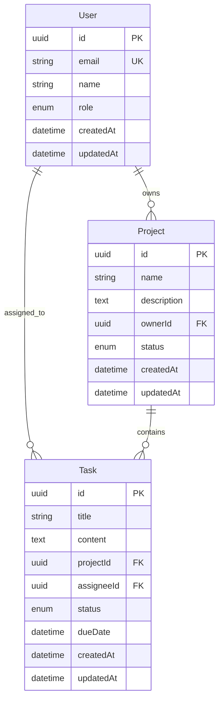

# CMD_sys_02_データベース設計

最終更新日時: 2026年1月20日

# データベース設計・実装テンプレート

> **スキーマ設計からマイグレーション、シード作成まで**

---

## 🎯 このテンプレートでできること

- データベーススキーマ設計
- ER図作成
- マイグレーションファイル生成
- シードデータ作成
- インデックス・パフォーマンス設計

---

## 📋 実行前の質問（必須回答）

### 1. データベース種別
- RDB（PostgreSQL/MySQL/SQLite）
- NoSQL（MongoDB/DynamoDB）
- 混合（RDB + Redis等）

### 2. ORMツール
- Prisma（推奨）
- TypeORM / Drizzle
- SQLAlchemy（Python）
- なし（Raw SQL）

### 3. 管理対象エンティティ
- 主要なテーブル・コレクション名
- 各エンティティの主要属性
- リレーション（1:N, N:N等）

### 4. 非機能要件
- 想定レコード数
- 読み取り/書き込み比率
- パフォーマンス要件

---

## 🔄 実行手順

### Phase 1: エンティティ設計（15分）

```yaml
実行内容:
  - エンティティ一覧の作成
  - 属性の定義（型、制約、デフォルト値）
  - 主キー・外部キーの設計
  - リレーションの定義

成果物:
  - docs/database/entities.md
```

**AIの動作:**
```
📊 エンティティ設計を行います

【User】
- id: UUID (PK)
- email: String (UNIQUE, NOT NULL)
- name: String (NOT NULL)
- role: Enum(ADMIN, USER)
- createdAt: DateTime
- updatedAt: DateTime

【Project】
- id: UUID (PK)
- name: String (NOT NULL)
- description: Text (NULL)
- ownerId: UUID (FK -> User.id)
- status: Enum(DRAFT, ACTIVE, ARCHIVED)
- createdAt: DateTime
- updatedAt: DateTime

【Task】
- id: UUID (PK)
- title: String (NOT NULL)
- content: Text (NULL)
- projectId: UUID (FK -> Project.id)
- assigneeId: UUID (FK -> User.id, NULL)
- status: Enum(TODO, IN_PROGRESS, DONE)
- dueDate: DateTime (NULL)
- createdAt: DateTime
- updatedAt: DateTime

この設計で進めますか？
```

---

### Phase 2: ER図作成（10分）

```yaml
実行内容:
  - エンティティ間リレーションの可視化
  - カーディナリティの明示
  - 主要な属性の記載

成果物:
  - docs/database/er-diagram.mermaid
```

**AIの動作:**


---

### Phase 3: スキーマ定義（20分）

```yaml
実行内容:
  - Prisma/TypeORM等のスキーマファイル作成
  - 型定義の生成
  - バリデーションルールの設定

成果物:
  - prisma/schema.prisma（または相当ファイル）
```

**AIの動作（Prismaの場合）:**
```prisma
// prisma/schema.prisma

generator client {
  provider = "prisma-client-js"
}

datasource db {
  provider = "postgresql"
  url      = env("DATABASE_URL")
}

enum Role {
  ADMIN
  USER
}

enum ProjectStatus {
  DRAFT
  ACTIVE
  ARCHIVED
}

enum TaskStatus {
  TODO
  IN_PROGRESS
  DONE
}

model User {
  id        String    @id @default(uuid())
  email     String    @unique
  name      String
  role      Role      @default(USER)
  createdAt DateTime  @default(now())
  updatedAt DateTime  @updatedAt

  ownedProjects Project[] @relation("ProjectOwner")
  assignedTasks Task[]    @relation("TaskAssignee")

  @@index([email])
}

model Project {
  id          String        @id @default(uuid())
  name        String
  description String?
  status      ProjectStatus @default(DRAFT)
  createdAt   DateTime      @default(now())
  updatedAt   DateTime      @updatedAt

  ownerId String
  owner   User   @relation("ProjectOwner", fields: [ownerId], references: [id])

  tasks Task[]

  @@index([ownerId])
  @@index([status])
}

model Task {
  id        String     @id @default(uuid())
  title     String
  content   String?
  status    TaskStatus @default(TODO)
  dueDate   DateTime?
  createdAt DateTime   @default(now())
  updatedAt DateTime   @updatedAt

  projectId  String
  project    Project @relation(fields: [projectId], references: [id], onDelete: Cascade)

  assigneeId String?
  assignee   User?   @relation("TaskAssignee", fields: [assigneeId], references: [id])

  @@index([projectId])
  @@index([assigneeId])
  @@index([status])
  @@index([dueDate])
}
```

---

### Phase 4: マイグレーション・シード作成（15分）

```yaml
実行内容:
  - マイグレーションファイル生成
  - シードデータ作成
  - 実行確認

成果物:
  - prisma/migrations/（マイグレーションファイル）
  - prisma/seed.ts（シードスクリプト）
```

**AIの動作:**
```typescript
// prisma/seed.ts
import { PrismaClient, Role, ProjectStatus, TaskStatus } from '@prisma/client'

const prisma = new PrismaClient()

async function main() {
  // Users
  const admin = await prisma.user.create({
    data: {
      email: 'admin@example.com',
      name: '管理者',
      role: Role.ADMIN,
    },
  })

  const user1 = await prisma.user.create({
    data: {
      email: 'user1@example.com',
      name: 'ユーザー1',
      role: Role.USER,
    },
  })

  // Project
  const project = await prisma.project.create({
    data: {
      name: 'サンプルプロジェクト',
      description: 'これはサンプルプロジェクトです',
      status: ProjectStatus.ACTIVE,
      ownerId: admin.id,
    },
  })

  // Tasks
  await prisma.task.createMany({
    data: [
      {
        title: '要件定義',
        content: '要件を整理する',
        status: TaskStatus.DONE,
        projectId: project.id,
        assigneeId: admin.id,
      },
      {
        title: '設計',
        content: 'アーキテクチャを設計する',
        status: TaskStatus.IN_PROGRESS,
        projectId: project.id,
        assigneeId: user1.id,
      },
      {
        title: '実装',
        content: 'コードを書く',
        status: TaskStatus.TODO,
        projectId: project.id,
        dueDate: new Date('2026-02-01'),
      },
    ],
  })

  console.log('✅ Seed completed')
}

main()
  .catch(console.error)
  .finally(() => prisma.$disconnect())
```

---

### Phase 5: インデックス・最適化（10分）

```yaml
実行内容:
  - クエリパターン分析
  - インデックス設計
  - N+1問題対策
  - キャッシュ戦略

成果物:
  - docs/database/optimization.md
```

---

## ✅ 完了条件チェックリスト

- [ ] ER図が完成している
- [ ] スキーマファイルが作成されている
- [ ] マイグレーションが成功している
- [ ] シードデータが投入されている
- [ ] インデックスが適切に設定されている
- [ ] ドキュメントが整備されている

---

## 💡 よく使うパターン

### ソフトデリート
```prisma
model Post {
  id        String    @id @default(uuid())
  deletedAt DateTime?
  
  @@index([deletedAt])
}
```

### 多対多リレーション
```prisma
model User {
  id       String       @id
  projects UserProject[]
}

model Project {
  id    String       @id
  users UserProject[]
}

model UserProject {
  userId    String
  projectId String
  role      String @default("MEMBER")
  
  user    User    @relation(fields: [userId], references: [id])
  project Project @relation(fields: [projectId], references: [id])

  @@id([userId, projectId])
}
```

### 監査ログ
```prisma
model AuditLog {
  id        String   @id @default(uuid())
  action    String   // CREATE, UPDATE, DELETE
  entity    String   // User, Project, Task
  entityId  String
  userId    String
  changes   Json?
  createdAt DateTime @default(now())

  @@index([entity, entityId])
  @@index([userId])
  @@index([createdAt])
}
```

---

## 🔗 関連テンプレート

- [CMD_sys_01_アーキテクチャ設計](./CMD_sys_01_アーキテクチャ設計.md)
- [CMD_sys_03_API設計](./CMD_sys_03_API設計.md)
- [CMD_sys_05_バックエンド実装](./CMD_sys_05_バックエンド実装.md)

---

**作成日**: 2026-01-20
**カテゴリ**: システム構築
**タスクタイプ**: implementation
