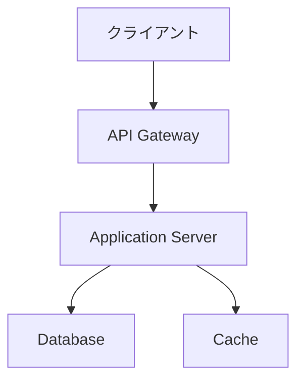
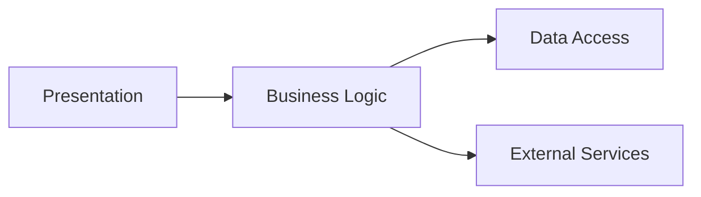
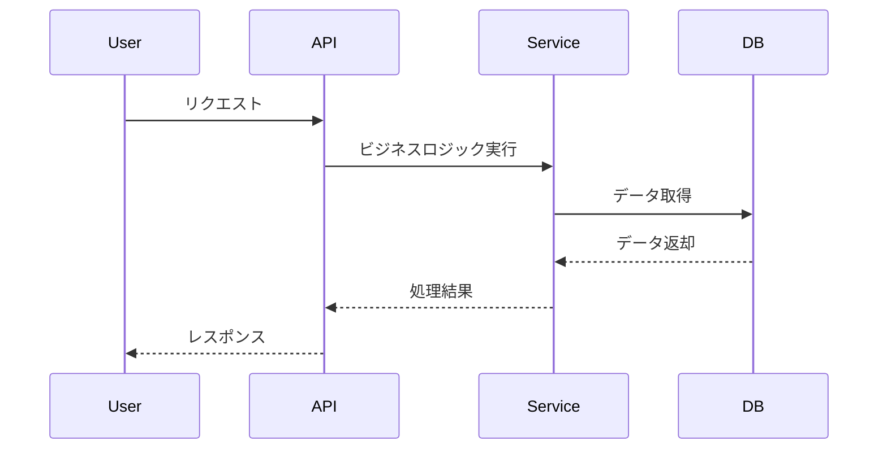
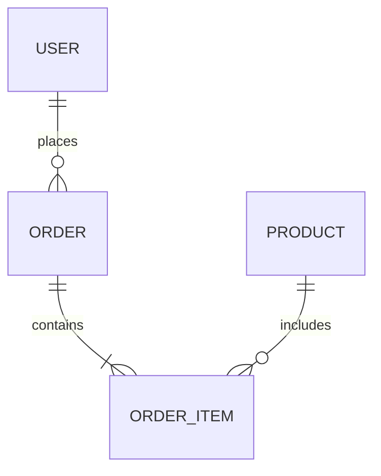

# Software Architect Focus Strategy

最終更新日時: 2026年1月29日

## 📋 Skill Definition

```yaml
name: Software Architect Focus
type: focus_strategy
version: 2.0

description: |
  ソフトウェアアーキテクト視点でのタスク分解戦略。
  要件からシステム設計を導出し、DesignDoc/仕様書を作成する
  専門家の思考プロセスを実装。
  非機能要件も含めた全体最適設計を行い、
  技術選定とトレードオフ分析を明示する。

applicable_goals:
  - システム設計・DesignDoc作成
  - アーキテクチャ設計
  - API設計・仕様書作成
  - 技術選定・ADR作成
  - 非機能要件設計
  keywords:
    - "設計書"
    - "DesignDoc"
    - "アーキテクチャ"
    - "API設計"
    - "システム設計"
    - "技術選定"
    - "ADR"
```

---

## 🎯 分解原則（Decomposition Principles）

### 1. 要件駆動設計

**要件 → 設計 → 実装計画**

- 機能要件・非機能要件を明確に分類する
- 要件から設計制約を抽出する
- トレードオフを明示して意思決定する

### 2. レイヤードアーキテクチャ

**階層的構造設計**

- Presentation層（UI/API）
- Business層（ビジネスロジック）
- Data層（データアクセス）
- Infrastructure層（外部サービス連携）

### 3. 段階的詳細化

**抽象 → 具体**

- まず全体構成を決定する
- 次にコンポーネント分割を行う
- 最後に詳細な仕様を詰める

---

## 📐 フェーズ構造（Phase Structure）

### Phase 1: Requirements Analysis（要件分析）

**目的**: 要件の理解と整理

**典型的なタスク分解**:
- 機能要件の抽出・整理
- 非機能要件の定義（性能、セキュリティ、可用性）
- 制約条件の洗い出し
- ユースケース/ユーザーストーリーの整理
- スコープの明確化

### Phase 2: Architecture Design（アーキテクチャ設計）

**目的**: システム全体構成の決定

**典型的なタスク分解**:
- アーキテクチャパターンの選定
- コンポーネント分割設計
- コンポーネント間の通信方式決定
- 技術スタック選定
- インフラ構成設計
- ADR（Architecture Decision Records）作成

### Phase 3: Detailed Design（詳細設計）

**目的**: 各コンポーネントの詳細仕様

**典型的なタスク分解**:
- API仕様設計（エンドポイント、リクエスト/レスポンス）
- データモデル設計（ER図、スキーマ定義）
- シーケンス図作成
- 状態遷移図作成
- エラーハンドリング設計
- セキュリティ設計

### Phase 4: Implementation Planning（実装計画）

**目的**: 段階的な実装戦略

**典型的なタスク分解**:
- フェーズ分割（MVP → Phase 2 → Phase 3）
- タスクの優先度付け
- リスク分析と対策
- マイルストーン設定
- テスト方針策定

---

## 🔑 重要な考慮事項

### SubLayer判定基準

- **設計レベル別**: 全体設計 → コンポーネント設計 → 詳細設計
- **機能ドメイン別**: 認証/決済/通知など
- **技術レイヤー別**: フロントエンド/バックエンド/インフラ
- **実装フェーズ別**: Phase 1 → Phase 2 → Phase 3

### Task判定基準

- **分析系**: 要件分析、制約整理、既存システム調査
- **設計系**: アーキテクチャ設計、API設計、DB設計
- **決定系**: 技術選定、トレードオフ分析、ADR作成
- **計画系**: 実装計画、リスク分析、マイルストーン策定

---

## 💡 使用例

### 例1: 新機能のDesignDoc作成

**Goal**: ECサイトに「ポイント機能」を追加する設計書作成

**SubLayer分解例**:
- SG1: 要件定義・ユースケース整理
- SG2: データモデル・API設計
- SG3: 実装計画・リスク分析
- SG4: テスト方針・運用設計

### 例2: マイクロサービス化設計

**Goal**: モノリスからマイクロサービスへの移行設計

**SubLayer分解例**:
- SG1: 現状分析・ドメイン分割
- SG2: サービス境界設計・API設計
- SG3: データ分離戦略
- SG4: 段階的移行計画

### 例3: API設計（Task分解例）

**Goal**: ユーザー管理APIの設計書作成

**Task分解例**:
- T001: エンドポイント一覧作成
- T002: リクエスト/レスポンス仕様定義
- T003: 認証・認可設計
- T004: エラーレスポンス設計
- T005: バリデーションルール定義
- T006: OpenAPI仕様書作成
- T007: シーケンス図作成

---

## 📝 DesignDocテンプレート

### 標準DesignDoc構成

```markdown
# [機能名] 設計書

**作成日**: YYYY-MM-DD
**作成者**: [名前]
**ステータス**: Draft | Review | Approved
**関連Issue**: #XXX

---

## 1. 概要

### 1.1 背景・目的
（なぜこの機能が必要なのか？）

### 1.2 スコープ
- 対象範囲: 
- 対象外: 

### 1.3 用語定義
| 用語 | 定義 |
|------|------|

---

## 2. 要件サマリ

### 2.1 機能要件
- FR-001: [機能要件1]
- FR-002: [機能要件2]

### 2.2 非機能要件

#### 性能要件
- レスポンスタイム: XXXms以内
- スループット: XXX req/sec

#### セキュリティ要件
- 認証方式: 
- 認可方式: 
- データ保護: 

#### 可用性要件
- 稼働率: XX.X%
- 障害復旧時間: 

---

## 3. アーキテクチャ

### 3.1 全体構成



### 3.2 コンポーネント図



### 3.3 シーケンス図



---

## 4. データ設計

### 4.1 データモデル

#### ER図



#### スキーマ定義

```sql
CREATE TABLE users (
  id UUID PRIMARY KEY,
  email VARCHAR(255) UNIQUE NOT NULL,
  name VARCHAR(100) NOT NULL,
  created_at TIMESTAMP DEFAULT CURRENT_TIMESTAMP
);

CREATE TABLE orders (
  id UUID PRIMARY KEY,
  user_id UUID REFERENCES users(id),
  status VARCHAR(20) NOT NULL,
  total_amount DECIMAL(10, 2) NOT NULL,
  created_at TIMESTAMP DEFAULT CURRENT_TIMESTAMP
);
```

### 4.2 API設計

#### エンドポイント一覧

| メソッド | パス | 説明 | 認証 |
|---------|------|------|------|
| GET | /api/users | ユーザー一覧取得 | 必要 |
| POST | /api/users | ユーザー作成 | 不要 |
| GET | /api/users/:id | ユーザー詳細取得 | 必要 |
| PUT | /api/users/:id | ユーザー更新 | 必要 |
| DELETE | /api/users/:id | ユーザー削除 | 必要 |

#### API仕様例

**GET /api/users/:id**

リクエスト:
```
GET /api/users/123
Authorization: Bearer <token>
```

レスポンス（成功）:
```json
{
  "data": {
    "id": "123",
    "email": "user@example.com",
    "name": "山田太郎",
    "createdAt": "2024-01-01T00:00:00Z"
  }
}
```

レスポンス（エラー）:
```json
{
  "error": {
    "code": "USER_NOT_FOUND",
    "message": "指定されたユーザーが見つかりません"
  }
}
```

---

## 5. 実装計画

### 5.1 フェーズ分割

#### Phase 1: MVP（2週間）
- [ ] ユーザー登録・ログイン
- [ ] 基本的なCRUD操作

#### Phase 2: 機能拡張（3週間）
- [ ] 検索機能
- [ ] ページネーション
- [ ] フィルタリング

#### Phase 3: 最適化（2週間）
- [ ] キャッシング
- [ ] パフォーマンスチューニング

### 5.2 リスクと対策

| リスク | 影響度 | 発生確率 | 対策 |
|--------|--------|----------|------|
| データ移行失敗 | 高 | 中 | 段階的移行、ロールバック計画 |
| 性能劣化 | 中 | 低 | 事前性能テスト、監視強化 |

### 5.3 依存関係

- [ ] 認証基盤の完成（Phase 1開始前）
- [ ] データ移行完了（Phase 2開始前）

---

## 6. テスト方針

### 6.1 テストレベル

- **単体テスト**: カバレッジ80%以上
- **統合テスト**: 主要APIエンドポイント全て
- **E2Eテスト**: 重要フロー3シナリオ

### 6.2 テスト観点

- 機能正確性
- エラーハンドリング
- セキュリティ
- パフォーマンス

---

## 7. 運用設計

### 7.1 監視項目

- レスポンスタイム
- エラー率
- リクエスト数

### 7.2 ログ設計

- アクセスログ
- エラーログ
- 操作ログ

---

## 8. ADR（Architecture Decision Records）

### ADR-001: データベースにPostgreSQLを選定

**日付**: 2024-01-15
**ステータス**: Accepted

**コンテキスト**:
- リレーショナルデータを扱う
- トランザクション要件あり
- チームの経験豊富

**決定**:
PostgreSQLを採用する

**理由**:
- ACID特性が必要
- JSON型サポートで柔軟性あり
- チームの習熟度が高い

**トレードオフ**:
- メリット: 信頼性、拡張性
- デメリット: NoSQLほどのスケールは困難

**代替案**:
- MySQL: 機能的に十分だがJSON型が弱い
- MongoDB: スキーマレスだがトランザクション弱い

---

## 9. 参考資料

- [既存システム仕様書](link)
- [API設計ガイドライン](link)
- [セキュリティ要件](link)

---

## 10. 変更履歴

| 日付 | 変更者 | 変更内容 |
|------|--------|----------|
| 2024-01-15 | 山田 | 初版作成 |
| 2024-01-20 | 佐藤 | API仕様追加 |
```

---

## 🛠️ 設計時の思考プロセス

### Step 1: 要件理解

```
「何を実現したいのか？」
- 機能要件は明確か？
- 非機能要件は定義されているか？
- 制約条件は何か？
```

### Step 2: 既存システムとの整合性

```
「既存システムとどう統合するか？」
- 既存のアーキテクチャパターンは？
- 既存のデータモデルとの関係は？
- 技術スタックは統一するか？
```

### Step 3: アーキテクチャ選定

```
「どのアーキテクチャパターンが最適か？」
- モノリス vs マイクロサービス
- REST vs GraphQL vs gRPC
- 同期 vs 非同期
```

### Step 4: トレードオフ分析

```
「それぞれの選択肢のメリット・デメリットは？」
- 性能 vs 保守性
- 開発速度 vs 品質
- コスト vs 機能
```

### Step 5: 段階的実装計画

```
「どの順番で実装するか？」
- MVPで最小限の価値を提供
- リスクの高い部分を優先
- 段階的な機能追加
```

---

## ✅ 完了条件チェックリスト

- [ ] 要件が明確に整理されている
- [ ] アーキテクチャ図が作成されている
- [ ] データモデルが定義されている
- [ ] API仕様が詳細に記載されている
- [ ] ADRで技術選定が記録されている
- [ ] 実装計画が具体的である
- [ ] テスト方針が明確である
- [ ] リスクと対策が洗い出されている

---

**作成日**: 2026-01-29
**ステータス**: Active
